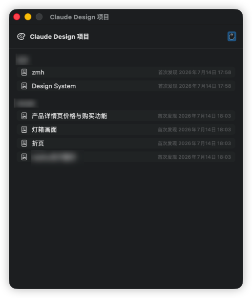

# Tidewatch


**English** · [中文](README.zh-CN.md)

A macOS menu-bar app that keeps an eye on all your AI-coding subscription quotas in **one place** — multiple **Claude** (Pro/Max), **Codex** (ChatGPT Plus/Pro), and **GLM** (z.ai overseas Coding Plan) accounts, so you always know how much is left and when it resets.

The interface is **bilingual** — it follows your system language (Simplified/Traditional Chinese → Chinese, everything else → English) — and adapts to light/dark mode.

> ⚠️ Tidewatch reads the **unofficial, undocumented endpoints** used by each vendor's CLI / web app (reverse-engineered from Claude Code, Codex CLI, and the z.ai web dashboard). It only shows the usage of **your own accounts**. These endpoints can change or disappear at any time — see [Important notes](#important-notes).

---

## Screenshots

<p align="center"></p>

<p align="center"><em>Main panel: Claude / Codex / GLM accounts at a glance — per-window usage, reset countdown, plan tier, renewal date, and payment method.</em></p>

<table align="center">
  <tr>
    <td align="center"><br><sub>Add Claude (browser auth → paste code)</sub></td>
    <td align="center"><br><sub>Add GLM (paste your z.ai API key)</sub></td>
  </tr>
</table>

<p align="center"></p>

<p align="center"><em>Per-model weekly limits (Fable / Opus / Sonnet…); bars go green → orange → red as usage climbs; each card links to that account's Design projects.</em></p>

<p align="center"></p>

<p align="center"><em>Claude Design projects: grouped by account, click a name to open it, annotated with the time Tidewatch first saw it.</em></p>

---

## Features

- **Multiple providers, multiple accounts** — Claude / Codex / GLM, several accounts each, all in one panel.
- **Usage at a glance** — each time window (5-hour / weekly / monthly, etc.) shows the used percentage, a progress bar (green → orange → red), a **reset countdown**, and a plan-tier badge (`MAX` / `PRO` / `LITE` …).
- **Per-model breakdown** — Claude's Fable / Opus / Sonnet weekly limits and Codex's extra-model limits are listed on separate rows.
- **Renewal date** — shown automatically for Codex (from its id_token); can be **entered manually** for any account.
- **Payment-method memo** — tag each account with Apple Pay (Apple ID) / Google Pay (email) / a credit card (**only the last 4 digits are ever stored** — never the full number).
- **Claude Design projects** — after signing in, list that account's Design projects (name + open link).
- **Auto-refresh** — every 3 / 5 / 15 / 30 minutes, plus manual refresh.
- **Local-first** — tokens live in the macOS Keychain, the account list in a local file; nothing is uploaded to any third party.

---

## Install

Requires **macOS 14+**. Universal build (Apple Silicon + Intel).

### Download the .dmg (recommended)

Grab the latest `Tidewatch-*.dmg` from the [**Releases**](https://github.com/ZhiMaHang/tidewatch/releases) page, open it, and drag **Tidewatch** into **Applications**.

Tidewatch is **not Apple-notarized** (this is an open-source, zero-budget project — the code is here for you to audit). So on first launch macOS may complain:

- On **macOS 15 (Sequoia) and later**, you'll often see *"Tidewatch is damaged and can't be opened."* — that's the expected behavior for an unsigned app, **not** a problem with your Mac or the download. Clear the download-quarantine flag in **Terminal**:

  ```bash
  xattr -dr com.apple.quarantine /Applications/Tidewatch.app
  ```

- Alternatively: **System Settings → Privacy & Security → scroll to the bottom → "Open Anyway"**, then confirm. *(Note: right-clicking → Open no longer bypasses Gatekeeper on macOS 15+.)*

On first account import, macOS asks to access your **Claude Code / Codex credentials** — that's reading the local CLI's own usage credentials, on your Mac only, nothing uploaded. Click **Always Allow**.

> Because the build is unsigned, its signature changes with every release, so macOS may prompt for Keychain access **again after an update** — that's the unsigned build, not a bug. (An Apple-notarized build would fix this; it isn't in scope for a zero-budget project yet.)

### Or build it yourself

Don't want to trust a binary? Build from source (nothing leaves your machine):

```bash
git clone https://github.com/ZhiMaHang/tidewatch.git
cd tidewatch
./scripts/build-app.sh          # produces dist/Tidewatch.app (current arch)
cp -R dist/Tidewatch.app /Applications/
open /Applications/Tidewatch.app
```

---

## Usage

### Open the panel

Once running, a **wave icon** appears in the menu bar. **Click it** to open the usage panel — every account's quota is shown there. (The app has no Dock icon; it lives only in the menu bar.)

### Add an account

Top-right **⋯ → Add Claude / Codex / GLM account** (or the buttons on the empty state).

#### Claude (Pro / Max)

Two ways, pick either:

1. **In-app login** (recommended, supports multiple accounts):
   - Click "Open authorization page" → sign in with the **specific** Claude account you want to add and authorize it;
   - Paste the code shown on the callback page (looks like `xxxx#yyyy`) back into the field → finish.
2. **Import local Claude Code CLI credentials** — if you're already logged in via `claude` in a terminal, import with one click.

#### Codex (ChatGPT Plus / Pro)

1. **Import `auth.json`** (recommended) — point to the `~/.codex/auth.json` produced by the Codex CLI login; for multiple accounts, point each at a different `CODEX_HOME` (e.g. `~/.codex-work/auth.json`).
2. **Browser login** — click "Sign in with browser"; the localhost callback completes it automatically.

#### GLM (z.ai overseas)

- Paste your **z.ai API key** — the same value you set as `ANTHROPIC_AUTH_TOKEN` in Claude Code.
- Get the key from the z.ai console: [z.ai/manage-apikey](https://z.ai/manage-apikey).

### Reading a card

Each account is one card:

- Top-left service tag (C / X / G), account name, and **plan badge**;
- Each quota window below: title, **used percentage**, progress bar, and a **"resets in …"** countdown;
- Some also show: renewal date, payment method, a Design-projects link, and extra credits.

### Per-account actions (the card's ⋯ menu)

| Menu item | What it does |
|---|---|
| Rename… | Change how this account is labeled in Tidewatch |
| Set renewal date… | Manually enter the renewal/expiry date (for when the API doesn't provide it) |
| Set payment method… | Apple Pay / Google Pay / credit card (card keeps only the last 4 digits) |
| Sign in to Claude Design… (Claude only) | Authorize, then browse that account's Design projects |
| Refresh | Refresh this account now |
| Remove account | Delete the account and wipe its local credentials |

### Claude Design projects

**⋯ → Claude Design projects…** opens a separate window that lists projects grouped by account (name + clickable link + **first-seen time**).

> The Claude Design API doesn't return a project's creation/modification time, so the "time" shown is when **Tidewatch first saw** the project — not the project's real timestamp.

### Refresh interval / Quit

Both live in the ⋯ menu: the refresh interval can be 3 / 5 / 15 / 30 minutes; Quit Tidewatch is there too.

### Language

Follows the system: if your system language is Simplified or Traditional Chinese → Chinese UI; otherwise → English. Restart Tidewatch after changing the system language.

---

## Data & privacy

- **Credentials** (per-account tokens, GLM API keys) live in the macOS **Keychain** (service `com.zhimahang.tidewatch.credentials`), not in plain files.
- The **account list** (no secrets) lives in `~/Library/Application Support/Tidewatch/accounts.json`.
- Tidewatch **only reads the usage of your own accounts** and **uploads nothing to any third-party server** — every request goes straight to the corresponding official endpoint.
- **Credit cards store only the last 4 digits** (`•••• 1234`); the full number never touches disk.

---

## Important notes

Everything Tidewatch relies on is an **unofficial, undocumented** endpoint (reverse-engineered from Claude Code / Codex CLI / the z.ai web dashboard):

- These endpoints **can change or be taken down at any time**, after which the corresponding usage simply won't load — that's expected, not a bug.
- Reusing an official CLI's OAuth client / private endpoints is a **gray area**; evaluate it yourself, follow each service's terms, and use at your own risk.
- This project is **only for viewing your own subscription usage** — nothing more.

---

## Development

Pure Swift Package Manager, no Xcode project.

```bash
swift build                       # compile
swift run Tidewatch               # run (menu bar)
.build/debug/Tidewatch --check    # headless self-check, prints each account's usage
```

Source lives in `Sources/Tidewatch/` (`Providers/` per-vendor APIs, `Auth/` login flows, `Store/` Keychain & persistence, `UI/` the interface).

---

## License

MIT © 2026 智码航 (ZhiMaHang). See [LICENSE](LICENSE).
