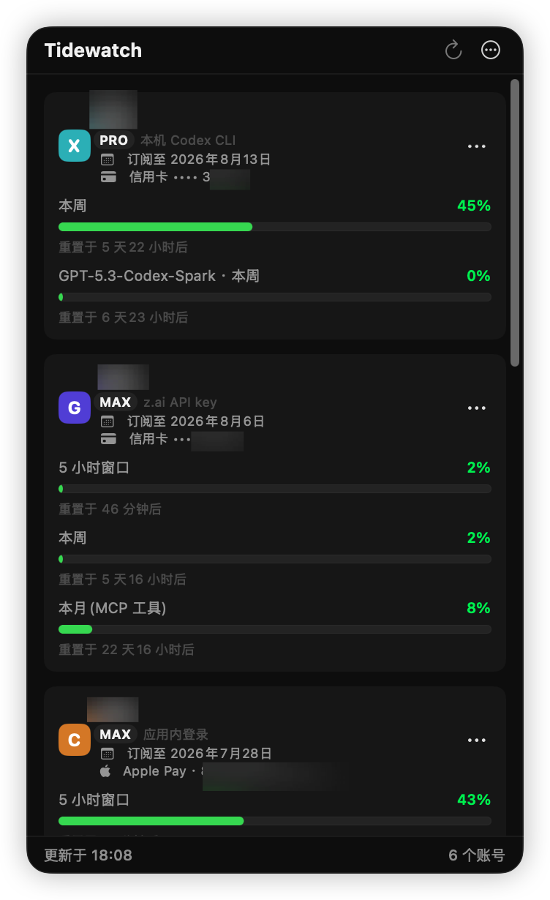
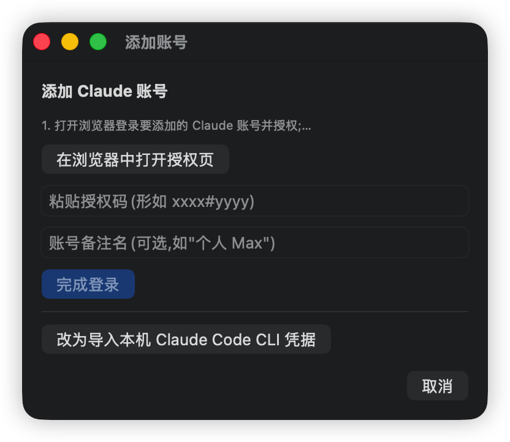
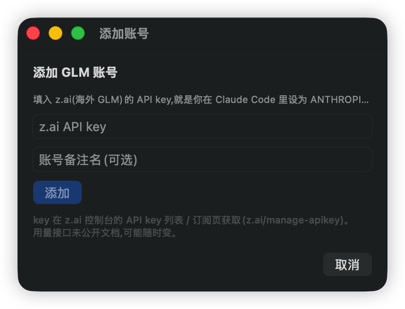
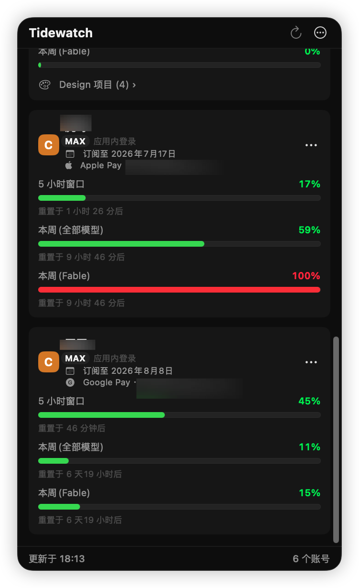

# Tidewatch


一个 macOS 菜单栏应用,在**一个地方**盯着你所有 AI 编码订阅的额度——多个 **Claude**(Pro/Max)、**Codex**(ChatGPT Plus/Pro)、**GLM**(z.ai 海外版 Coding Plan)账号,随时知道还剩多少、什么时候重置。

界面**中英双语**(跟随系统语言:简/繁中文用中文,其它用英文),自动适配浅色/深色。

> ⚠️ Tidewatch 读取的是各家 CLI / 网页端的**非官方、未公开文档接口**(逆向自 Claude Code、Codex CLI、z.ai 网页版)。只用来看**你自己账号**的用量。接口随时可能变动失效,详见 [重要说明](#重要说明必读)。

---

## 截图

<p align="center"></p>

<p align="center"><em>主面板:Claude / Codex / GLM 多账号一屏,各时间窗口用量、重置倒计时、套餐档、订阅到期日、付款方式一目了然。</em></p>

<table align="center">
  <tr>
    <td align="center"><br><sub>添加 Claude(浏览器授权 → 粘贴授权码)</sub></td>
    <td align="center"><br><sub>添加 GLM(贴入 z.ai API key)</sub></td>
  </tr>
</table>

<p align="center"></p>

<p align="center"><em>按模型细分的周额度(Fable / Opus / Sonnet…),进度条随用量绿 → 橙 → 红;每张卡片可进入该账号的 Design 项目列表。</em></p>

---

## 功能一览

- **多提供方、多账号**:Claude / Codex / GLM,每家可加多个账号,一屏汇总。
- **额度可视化**:每个时间窗口(5 小时 / 本周 / 本月等)显示已用百分比、进度条(绿 → 橙 → 红)、**重置倒计时**,以及套餐档徽章(如 `MAX` / `PRO` / `LITE`)。
- **按模型细分**:Claude 的 Fable / Opus / Sonnet 周额度、Codex 的附加模型额度,都会分行列出。
- **订阅到期日**:Codex 自动显示(来自 id_token);其它账号可**手动填写**。
- **付款方式备忘**:给每个账号记 Apple Pay(Apple ID)/ Google Pay(邮箱)/ 信用卡(**只存后四位**,绝不保存完整卡号)。
- **Claude Design 项目**:登录后可列出该账号的 Design 项目(名称 + 打开链接)。
- **自动刷新**:3 / 5 / 15 / 30 分钟可选,也可手动刷新。
- **本地优先**:token 存本机钥匙串,账号列表存本机文件,不向任何第三方上传数据。

---

## 安装

要求 **macOS 14+**。

```bash
git clone https://github.com/ZhiMaHang/tidewatch.git
cd tidewatch
./scripts/build-app.sh          # 生成 dist/Tidewatch.app
cp -R dist/Tidewatch.app /Applications/
open /Applications/Tidewatch.app
```

应用为 ad-hoc 签名(非公证)。首次打开若被 Gatekeeper 拦,到「系统设置 → 隐私与安全性」点**仍要打开**。首次读取钥匙串 / 本机 CLI 凭据时系统会弹授权框,点**始终允许**即可。

---

## 使用

### 打开面板

启动后,菜单栏出现**波浪图标**。**点它**就弹出额度面板;各账号额度都在这里看。(应用不占程序坞,只在菜单栏。)

### 添加账号

面板右上角 **⋯ → 添加 Claude / Codex / GLM 账号**(或首次的空状态按钮)。

#### Claude(Pro / Max)

两种方式,任选:

1. **应用内登录**(推荐,支持多账号):
   - 点「在浏览器中打开授权页」→ 用**要添加的那个** Claude 账号登录并授权;
   - 把回调页显示的授权码(形如 `xxxx#yyyy`)**粘回输入框** → 完成登录。
2. **导入本机 Claude Code CLI 凭据**:如果你已在终端 `claude` 登录过,一键导入即可。

#### Codex(ChatGPT Plus / Pro)

1. **导入 `auth.json`**(推荐):填 Codex CLI 登录后的 `~/.codex/auth.json` 路径;多账号可指向不同 `CODEX_HOME` 目录(如 `~/.codex-work/auth.json`)。
2. **浏览器登录**:点「在浏览器中登录」,授权后自动回调完成。

#### GLM(z.ai 海外版)

- 贴入 **z.ai 的 API key**——就是你在 Claude Code 里设为 `ANTHROPIC_AUTH_TOKEN` 的那个值。
- key 在 z.ai 控制台获取:[z.ai/manage-apikey](https://z.ai/manage-apikey)。

### 看懂卡片

每个账号一张卡片:

- 左上服务标(C / X / G)、账号名、**套餐徽章**;
- 下方每个额度窗口:标题、**已用百分比**、进度条、**重置于 …** 倒计时;
- 有的还显示:订阅到期日、付款方式、Design 项目入口、额外 Credits。

### 每个账号的操作(卡片右侧 ⋯)

| 菜单项 | 说明 |
|---|---|
| 重命名… | 改这个账号在 Tidewatch 里显示的名字 |
| 设置订阅到期日… | 手填订阅到期/续订日(接口拿不到时用) |
| 设置付款方式… | Apple Pay / Google Pay / 信用卡(信用卡只留后四位) |
| 登录 Claude Design…(仅 Claude) | 授权后即可看该账号的 Design 项目 |
| 刷新 | 立即刷新这个账号 |
| 移除账号 | 删除账号并清掉其本机凭据 |

### Claude Design 项目

⋯ 菜单 → **Claude Design 项目…**,打开独立窗口,按账号列出项目(名称 + 可点开的链接 + **首次发现时间**)。

> Claude Design 接口不返回项目的创建/修改时间,所以"时间"是 **Tidewatch 首次看到该项目的时间**,非项目真实时间。

### 刷新间隔 / 退出

都在 ⋯ 菜单里:刷新间隔可选 3 / 5 / 15 / 30 分钟;退出 Tidewatch 也在这。

### 语言

跟随系统:系统语言为简体或繁体中文 → 中文界面;其它 → 英文。改了系统语言后重启 Tidewatch 生效。

---

## 数据与隐私

- **凭据**(各账号 token、GLM API key)存本机 **钥匙串**(service `com.zhimahang.tidewatch.credentials`),不写进普通文件。
- **账号列表**(不含密钥)存 `~/Library/Application Support/Tidewatch/accounts.json`。
- Tidewatch **只读你自己账号**的额度,**不向任何第三方服务器上传数据**;所有请求都直连对应官方接口。
- **信用卡只保存后四位**(`•••• 1234`),完整卡号永不落盘。

---

## 重要说明(必读)

Tidewatch 依赖的都是**非官方、未公开文档**的接口(逆向自 Claude Code / Codex CLI / z.ai 网页版):

- 这些接口**随时可能变更或下线**,届时对应额度会读不到——属预期,不是 bug。
- 复用官方 CLI 的 OAuth 客户端 / 私有端点属于**灰色地带**,请自行评估并遵守各服务条款,风险自负。
- 本项目**仅供查看你自己账号的订阅用量**,不做任何越权或规避用途。

---

## 开发

纯 Swift Package Manager,无 Xcode 工程。

```bash
swift build                       # 编译
swift run Tidewatch               # 直接运行(菜单栏)
.build/debug/Tidewatch --check    # 无头自检,打印各账号额度(脚本化验证用)
```

源码在 `Sources/Tidewatch/`(`Providers/` 各家接口、`Auth/` 登录流、`Store/` 钥匙串与持久化、`UI/` 界面)。

---

## License

MIT © 2026 智码航,详见 [LICENSE](LICENSE)。
